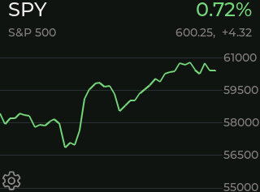
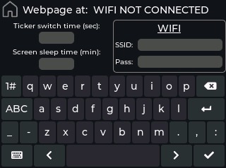

# DeskTicker

DeskTicker is a compact and customizable stock display designed for a small display module. This project was originally designed for the ESP32-2432S032 board but could be easily adapted to other Arduino compatible displays. It displays current stock prices and daily changes, along with a visual chart of daily data. DeskTicker also includes a user-friendly web interface for managing the list of stocks to display.

<p align="center">&emsp;</p>  

## Features

- **Real-Time Price Updates**: Displays the current stock price, daily change, and a chart of the stock's daily performance.
- **Web Configuration**: Easily update the list of stocks to monitor through a hosted web page.
- **Customizable**: While optimized for the ESP32-2432S032 display, the code can be adapted for other ESP32-based displays.
- **Local Data Storage**: The historic price data is stored locally on a microSD card to minimize API calls.


## Hardware Requirements

- **ESP32-2432S032 Display Module** (or other compatible display with minor modifications).
- **MicroSD Card** (no need for a large capcity)
- Power supply


## Installation

1. Clone the repository:
   ```bash
   git clone https://github.com/hemingerg1/DeskTicker.git
   ```

2. Install [VS Code](https://code.visualstudio.com/) and the [Platformio](https://platformio.org/install) extension if not already installed.

3. Prepare the SD card.
   - Insert the card into a computer and format it as FAT32.
   - Save the `/DeskTicker_pio/index.html` file to the root directory of the SD card.
   - Insert the card into your display

4. Flash the code to your ESP32 module using PlatformIO:
   - Open the `/DeskTicker_pio` folder with Platformio.
   - Change timezone information in `/DeskTicker_pio/src/main.cpp` if not in US EST.
   - Build and upload the code to the ESP32 module.

5. Power on the device and access the web interface to configure the stocks to display.
   - On the first boot the settings screen will be displayed where you need to enter your Wi-Fi credentials.
   - Once connected to Wi-Fi it will show the address where you can access the webpage to enter the tickers you want to display.


## Usage

1. **Power on the device**: The DeskTicker will connect to the configured Wi-Fi network.
2. **Access the web page**: Use a browser to navigate to the device's IP address. The address is displayed at the top of the settings screen.
3. **Configure stocks**: Add or remove stocks to customize the display.
4. **View the display**: Stock data and charts will be updated automatically.


## Adapting to Other Displays

DeskTicker is designed for the ESP32-2432S032 display but should be easily adapted to other displays. If using another Sunton display simply download the json file for your board from [platformio-espressif32-sunton](https://github.com/rzeldent/platformio-espressif32-sunton) and save it in the `/DeskTicker_pio/boards` folder. Then update the platformio.ini file to include the new board. If using a different board you will need to provide your own appropriate libraries and drivers.

## Software Requirements
The project requires the following software dependencies:
- Platformio: used for compiling and flashing the firmware
    - Libraries:
      - rzeldent/esp32_smartdisplay
	   - ottowinter/ESPAsyncWebServer-esphome
	   - fbiego/ESP32Time
	   - bblanchon/ArduinoJson
- Squarline Studio: used to create and modify the UI

<br>  
<br>  

<details>
<summary> Contributing</summary>  
Contributions are welcome! If you find bugs or have ideas for improvements, feel free to open an issue or submit a pull request.
</details>


